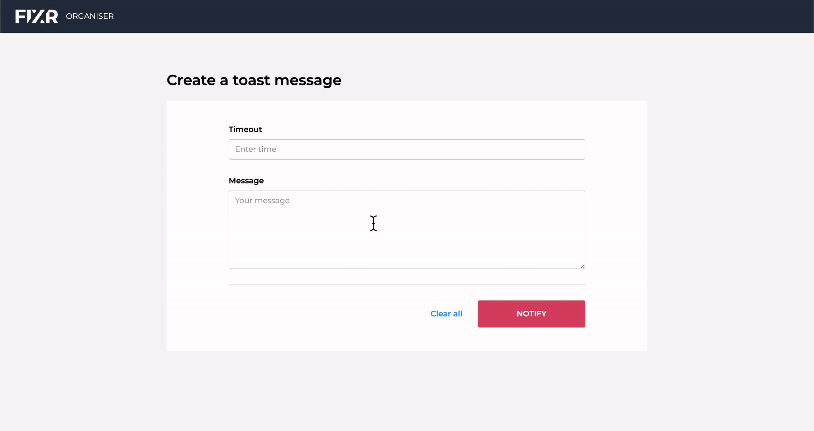

# Fixr Frontend Coding Challenge

## Description

This is the Fixr frontend coding challenge to build a notification app. Thank you for taking the time to take a look at my submission!

## Libraries/Tools used

- Typescript with React
- React Context for state management
- TailwindCSS for styling
- React Spring for progress bar animation
- React testing library for unit testing

## Assumptions

- I have assumed that the category of the notification cycles to the next category when clicking notify. For example, after a Success notification appears, the next will be an Info, followed by Warning.
- The app should be usable on a mobile device screen size
- We don't need to clear the form between notifying

## Improvements

I have tried to time box my attempt at this challenge. Given more time I would:

- Add further animations to the notifications when previous is removed in the list.
- Add further testing to the Notification form. Currently only testing if the button is enabled/disabled.
- I would also consider moving the input and text area in the form to their own components, this would be beneficial if the app requires more forms in the future.
- I would also consider adding a form library such as Formik to deal with additional forms in the future. This would make validation quicker to develop.
- If we wanted to verify the entire flow, it would be good to add e2e testing with Cypress to do this.

## Setting project up

- Inside the root folder run `yarn && yarn start`. Open [http://localhost:3000](http://localhost:3000) to view it in the browser.

## Example usage

## Thank you!
